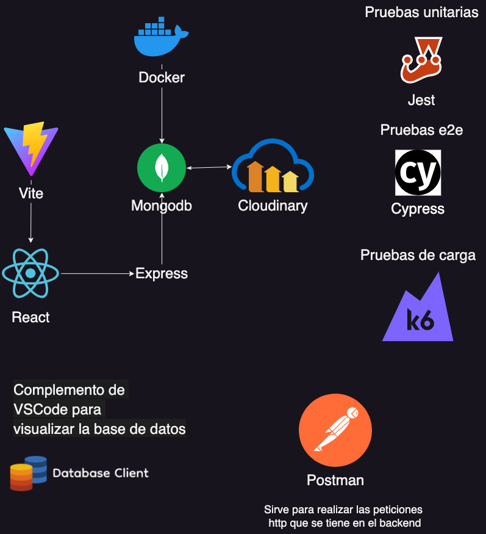

# Índice

## ejemplo of youtube del clon de twitter
https://www.youtube.com/watch?v=4GUVz2psWUg&t=227s


## Título del Proyecto
desarrollo de un clon de twitter

## Descripción 🚀
Se realizara un ejemplo de un clon de twitter con las tecnologias: docker(mongodb), react, express, jest, cypress, k6


### Pre-requisitos 📋

Que cosas necesitas instalar

```
docker
node 20 o nvm version 20
vite
k6
```

## Explicación de las tecnologías
Muy brevemente sobre lo que se realiza en cada una

*[docker(mongodb)](https://www.docker.com/)
Contenedor para la base de datos mongodb.

*[node](https://nodejs.org/en/download/package-manager)
React en el frontend, Express para el backend en el servidor.

*[cypress](https://www.cypress.io/)
Es el que realiza las pruebas e2e en el frontend.

*[k6](https://k6.io/)
Se realizan las pruebas de carga.

*[jest](https://jestjs.io/)
Se realizan las pruebas unitarias.

*[postman](https://www.postman.com/)
Es un complemento para realizar peticiones http.

*[Database Client JDBC](https://database-client.com/#/home)
Es un complemento para realizar conexiones con base de datos (relacionales y no relacionales).

## Arquitectura
imagen de representacion de la app y herramientas de VScode




## Demostracion de app y herramientas de Vscode

link: https://database-client.com/#/home

## Expresiones de Gratitud 🎁

* Comenta a otros sobre este proyecto 📢
* Invita una cerveza 🍺 o un café ☕ a alguien del equipo. 
* Da las gracias públicamente 🤓.


---
⌨️ con ❤️ por [fmps91](https://github.com/fmps91) 😊